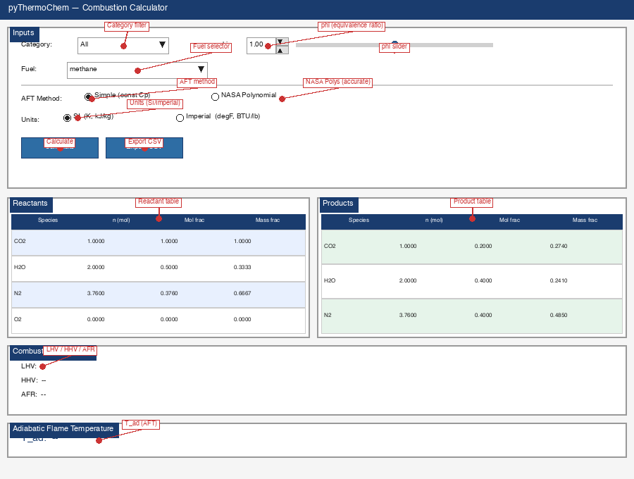
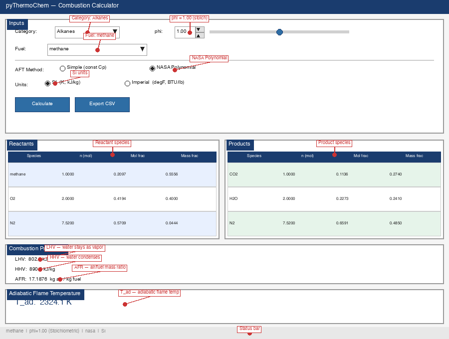
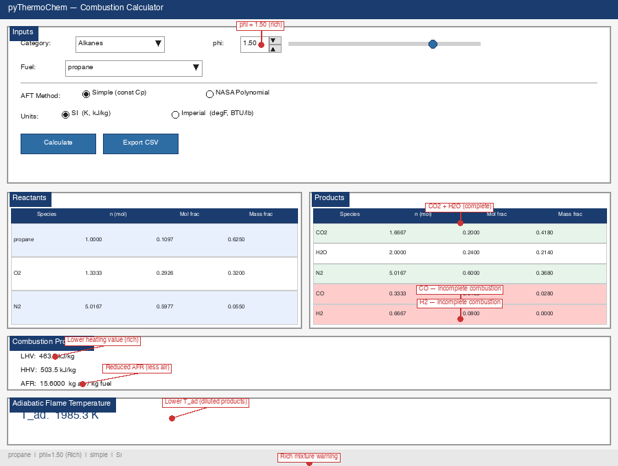

# pyThermoChem

A combustion thermodynamics calculator with a GUI. Balance stoichiometric reactions, compute heating values (LHV/HHV), air-fuel ratios, and adiabatic flame temperatures for 58 fuels.

[](https://creativecommons.org/licenses/by-nc-sa/4.0/)

## Quick Start

```
python src/main.py
```

No installation, no `pip install`, no virtual environment. Just Python 3.8+ with tkinter.

## What It Does

pyThermoChem calculates combustion stoichiometry and thermodynamic properties:

- **Reaction balancing** for lean, stoichiometric, and rich mixtures
- **Heating values** (LHV and HHV)
- **Stoichiometric air-fuel ratio** (mass basis)
- **Adiabatic flame temperature** via two methods: constant mean Cp or NASA 7-coefficient polynomials

## 58 Fuels, 12 Categories

| Category | Count | Examples |
|---|---|---|
| Alkanes | 8 | methane, ethane, propane, n-heptane, isooctane |
| Alkenes | 6 | ethene, propene, 1-butene, 1-octene |
| Alkynes | 2 | acetylene, propyne |
| Aromatics | 4 | benzene, toluene, xylene, styrene |
| Alcohols | 5 | methanol, ethanol, 2-propanol, tert-butanol |
| Ethers | 3 | dimethyl ether, MTBE, diethyl ether |
| Carbonyls | 4 | acetone, acetaldehyde, formaldehyde |
| Acids | 2 | acetic acid, formic acid |
| Polyols | 2 | ethylene glycol, glycerol |
| Heterocycles | 2 | furfural, levulinic acid |
| Cycloalkanes | 2 | methylcyclohexane, ethylcyclohexane |
| Elemental | 1 | hydrogen |

## How to Use

1. **Category** -- The dropdown filters the fuel list. Select "All" for the full set, or pick a category to narrow down.
2. **Fuel** -- Choose the fuel to analyze.
3. **phi (equivalence ratio)** -- Set with the Spinbox (type a number) or the slider (drag). Range: 0.1 to 2.0.
4. **AFT Method** --
   - **Simple (const Cp)**: Fast, uses constant mean heat capacities for products. Good for estimates.
   - **NASA Polynomial**: Iterative energy balance using NASA 7-coefficient polynomials. More accurate, accounts for temperature-dependent heat capacities.
5. **Units** --
   - **SI**: Temperature in Kelvin, heating values in kJ/kg.
   - **Imperial**: Temperature in degrees Fahrenheit, heating values in BTU/lb.
6. **Calculate** -- Runs the combustion calculation and displays results.
7. **Export CSV** -- Saves all results (summary + species tables) to a CSV file.

## Screenshots


*Figure 1: GUI at startup. Select category, fuel, and phi, then click Calculate.*


*Figure 2: Results after calculating methane at phi=1.0.*


*Figure 3: Rich mixture warning (phi=1.5 propane). CO and H2 appear in products.*

## Results Explained

### Reactants / Products Tables

Four columns per stream:

- **Species** -- Chemical formula or name
- **n (mol)** -- Moles per mole of fuel burned
- **Mol frac** -- Mole fraction in the stream
- **Mass frac** -- Mass fraction in the stream

Reactant rows are highlighted blue; product rows are green.

### Combustion Properties

- **LHV** (Lower Heating Value) -- Heat released when water in the products remains as vapor. This is the "net" heating value.
- **HHV** (Higher Heating Value) -- Heat released when water in the products condenses to liquid. Includes the latent heat of vaporization. Difference from LHV equals the condensation heat of the water produced.
- **AFR** (Air-Fuel Ratio) -- Stoichiometric mass of air required per unit mass of fuel. Actual air supply scales with 1/phi.

### Adiabatic Flame Temperature (T_ad)

The temperature the products reach when combustion proceeds with no heat loss to the surroundings (adiabatic) and no shaft work. Computed by balancing enthalpy of reactants at T0 (298.15 K) against enthalpy of products at unknown T.

### Rich Mixture Warning

When phi > 1.0, the mixture is fuel-rich and oxygen is insufficient for complete combustion. The calculator models this by producing CO and H2 alongside CO2 and H2O. The orange warning label appears when CO or H2 are present in the products.

## Key Parameter: Equivalence Ratio (phi)

phi = (actual fuel/air ratio) / (stoichiometric fuel/air ratio)

- **phi < 1.0** (Lean) -- Excess air. Products contain CO2, H2O, N2, and unreacted O2.
- **phi = 1.0** (Stoichiometric) -- Exactly enough air for complete combustion. Products contain CO2, H2O, N2 only.
- **phi > 1.0** (Rich) -- Fuel excess. Products contain CO2, H2O, N2, plus CO and H2 from incomplete combustion.

## Features

- 58 fuels across 12 hydrocarbon categories
- Two AFT calculation methods (Simple constant Cp, NASA Polynomial with bisection solver)
- SI and Imperial unit systems
- CSV export of all results
- Category-based fuel filtering
- Real-time phi slider with linked spinbox
- Zero external dependencies

## Requirements

- Python 3.8+
- tkinter (included with standard Python installations on Windows and macOS)

No `pip install` needed. See `requirements.txt`.

## License

This project is licensed under the [Creative Commons Attribution-NonCommercial-ShareAlike 4.0 International License](https://creativecommons.org/licenses/by-nc-sa/4.0/).


You are free to share and adapt the material for noncommercial purposes, provided you give appropriate credit, indicate if changes were made, and distribute contributions under the same license.

See the [LICENSE](LICENSE) file for the full legal text.
